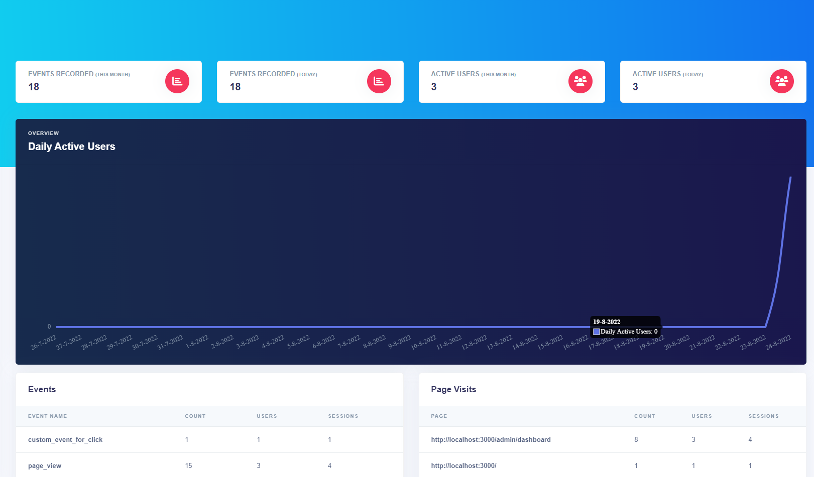
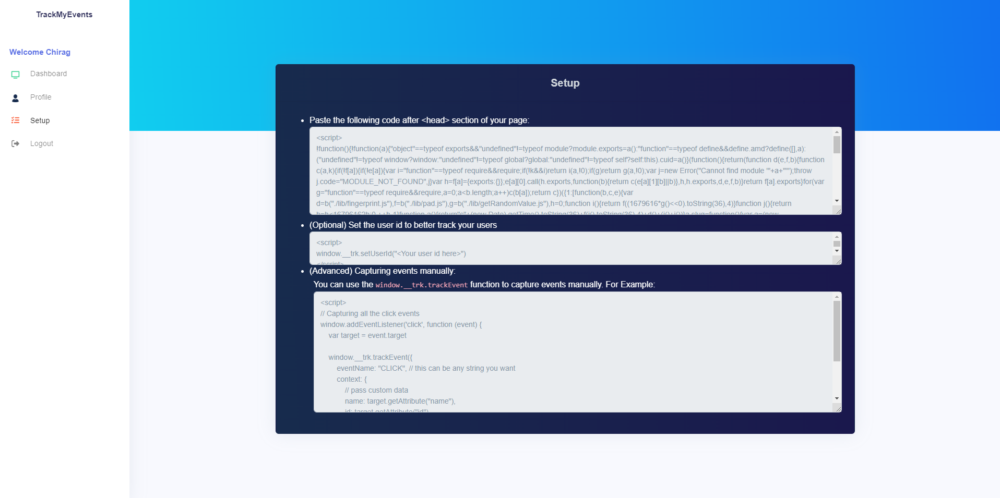
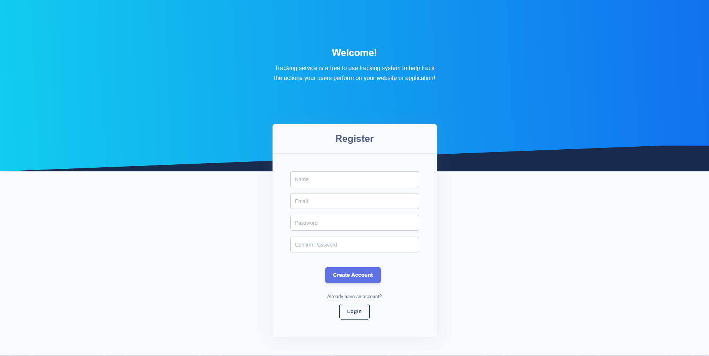
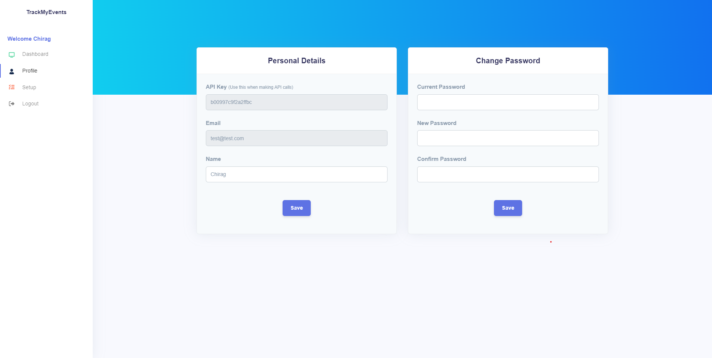

# Tracking System

An event tracking system built on microservices architecture using Redis Stack as the primary database & communication mechanism (pub/sub) for backend & React for frontend.




<!-- # Overview video (Optional)

Here's a short video that explains the project and how it uses Redis:

[Insert your own video here, and remove the one below]

[](https://www.youtube.com/watch?v=vyxdC1qK4NE) -->

## How it works

### Services

There are 3 services in tracking system:

#### 1. Gateway

This service is responsible for routing API requests to all the other services. Frontend always communicates with this server and never directly with any other service.
Gateway also authenticates every request to tracking service via user service.

#### 2. User Service

This service is responsible for storing & authenticating users.

##### Database Schema

1. User

```ts
class User extends Entity {
  public name: string
  public email: string
  public password: string
  public apiKey: string
  public createdAt: Date
  public updatedAt: Date | null
}
```

2. Access Token

```ts
class AccessToken extends Entity {
  public userId: string
  public token: string
  public expiresOn: Date
  public createdAt: Date
}
```

3. Refresh Token

```ts
class AccessToken extends Entity {
  public userId: string
  public token: string
  public createdAt: Date
}
```

#### 3. Tracking Service

This service is responsible for storing event data & then inferring analytics from it.

##### Database Schema

1. Event

```ts
class Event extends Entity {
  public internalUserId: string // id of our internal user to which this event is linked to

  public sessionId: string
  public eventTime: Date
  public eventName: string
  public page: string
  public referrer: string | null
  public _context: string // redisJSON doesn't support objects, so we store context in string form
  public userId: string // id of user where the tracking is being done. If user doesnt exist then a temp id is generated
  public userAgent: string | null
  public createdAt: Date
}
```

### Registration / Login



- The user data is stored as JSON where each user entry contains the values:

  - `name`: full name of the user
  - `email`: unique email of the user
  - `password`: hashed password
  - `apiKey`: unique auto-generated api key of the user. This is used when sending event data via sdk
  - `createdAt`: Date time when user was created
  - `updatedAt`: Date time when user updated their data. This is null if user never updated their data

- User data is accessed by key `User:{userId}`. The data for it is stored with `JSON.SET key path value`. User id is auto generated by the redis-om library.

- The authentication data is stored in various keys & data types.

  Every time a user logs in or registers, a pair of access token & refresh token is created. This access token is used to authenticate the user for any subsequent API requests. The generated access token
  expires after 1 hour after which refresh token can be used to generate a new pair of access & refresh token. The refresh tokens never expire so that users don't have to re-login.

  - Access token data is stored as JSON where each entry contains the values:

    - `userId`: entity id of the to which this access token belongs to
    - `token`: unique token for this access token. This is an auto generated random string
    - `expiresOn`: Date on which this access token expires.
    - `createdAt`: Date on which this access token was created.
      Access token data is accessed by key `AccessToken:{accessTokenId}`. The data for it is stored with `JSON.SET key path value`. Access token id is auto generated by the redis-om library.

  - Refresh token data is stored as JSON where each entry contains the values:
    - `userId`: entity id of the user to which this refresh token belongs to
    - `token`: unique token for this refresh token. This is an auto generated random string
    - `createdAt`: Date on which this refresh token was created.
      Refresh token data is accessed by key `RefreshToken:{accessTokenId}`. The data for it is stored with `JSON.SET key path value`. Refresh token id is auto generated by the redis-om library.

### Authentication

- Whenever user wants to make an authenticated request, they send their `access token` in the `Authorization` request header. All the requests are always made to the gateway service.
  The `gateway service` takes this Authorization header and fetches the user data from `user service`. If the user doesn't exist on user service, then the request is denied with a `401` status code. Otherwise, the request along with user data is passed on to the target (user/tracking) service.

### Profile Page



- The user data is already stored in the `User:{userId}` JSON key.
- The user can update either their `name` or `password`
  - If user wants to update their password then we verify the existing hash with the provided `current password`
- The updates are made using `JSON.SET key path value`

### Events

#### Pub/Sub

After initialization, a pub/sub subscription is created: `SUBSCRIBE events`. For simplicity, each message in pub/sub is serialized to JSON.

Pub/sub allows distributing the load among multiple servers and a layer between the APIs & the primary redis where we store event data. This is done so that the data is initally sent into the pub/sub and then consumed by tracking service in the background to avoid write bottlenecks.

How the data is stored:

- The event data is first sent to pub/sub with the following keys:

  - `apiKey`: apiKey of the tracking system's user who wants to track this event
  - `sessionId`: a random id generated on frontend by the SDK for tracking sessions of the users
  - `userId`: a user id provided by the SDK user. This user id usually comes from the client's system. If a user id isn't provided then we generate a temporary one so that we can identify the users.
  - `eventTime`: Timestamp in milliseconds when the event occurred
  - `page`: Url of the page on which this event occurred
  - `referrer`: Optionally, url of the page which referred this user
  - `context`: An arbitary JSON object which can contain any key-value pair. This is used to store custom data

- When consuming data from pub/sub subscription, the API key is first verified with the user service.

  - If a valid user exists with the given API key then the event data is stored in a hash set with key `Event:{eventId}`.
  - Otherwise this event is logged & ignored.

- Generating analytics from event data is done using RedisSearch module.

  - All the event data is filtered by the logged-in user's id
  - Events recorded over a month or day are calculated using `FT.SEARCH` command by filtering on `eventTime` value and then counting the rows. For this purpose, `@redis/search` module is used directly.
  - For more complex data points like activeUsers over a period of time or count of events over this lifetime is done using `FT.AGGREGATE` command directly.
  - For example, when calculating daily active users for last 30 days: - Filter the results by `internalUserId` & `eventTime` using the `query` argument of `FT.AGGREGATE` - Apply transformation to convert the `eventTime` to `day` in DD-MM-YYYY format using `timefmt` function. - Group the whole dataset by `day` - Get distinct count for every user.

    Final Query:

    ```
    FT.AGGREGATE "Event:index" "(
      (@internalUserId:{01GB16BRM2Y6P4S5SP7QMMWZFD})
      (@eventTime:[1658687400 +inf])
      (@eventTime:[-inf (1661279400])
    )"
    APPLY "timefmt(@eventTime, '%-d-%-m-%Y')" AS day
    GROUPBY 1 @day
      REDUCE COUNT_DISTINCT 1 @sessionId as sessions
      REDUCE COUNT_DISTINCT 1 @userId as users
    ```

## How to run it locally?

### Prerequisites

- Node - v16.15.0
- Yarn - v1.22.18
- Redis Stack Server

### Local installation

- Install the dependencies

```bash
yarn install
```

- Go to `services/user-service` (`cd ./services/user-service`) and then:

```bash
# copy file and set proper data inside
cp .env.example .env

yarn dev
```

- Go to `services/tracking-service` (`cd ./services/tracking-service`) and then:

```bash
# copy file and set proper data inside
cp .env.example .env

# run both these commands in separate terminals
yarn dev
yarn ts:subscriber
```

- Go to `services/gateway` (`cd ./services/gateway`) and then:

```bash
# copy file and set proper data inside
cp .env.example .env

yarn dev
```

- Go to `frontend` (`cd ./frontend`) and then:

```bash
# copy file and set proper data inside
cp .env.example .env

yarn start
```
